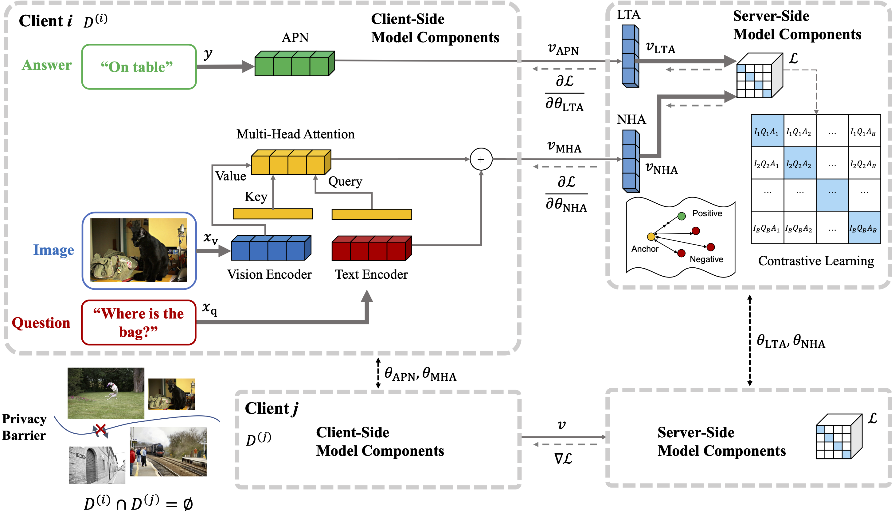

# bicsl
## Bidirectional Contrastive Split Learning for Visual Question Answering [AAAI 24 Technical Track](https://arxiv.org/abs/2208.11435)

We propose Bidirectional Contrastive Split Learning (BiCSL) to train a global multi-modal model on the entire data distribution of decentralized clients. We employ the contrastive loss that enables a more efficient self-supervised learning of decentralized modules. This repository includes the implementation of the experiments on the VQA-v2 dataset based on five SOTA VQA models. 

<p align="center">

</p>

## Dependencies 
Set up libraries:

    pip install -r requirements.txt

Install spacy embeddings for tokens:

	python -m spacy download en_vectors_web_lg

## Prepare the VQA-v2 dataset
The image features are extracted using the bottom-up-attention, with each image being represented as 2048-D features. Download the extracted features from [GoogleDrive]() or [OneDrive](). Place the file under the folder './data/vqa/'.


## Run BiCSL
Choose a VQA model from {mcan_small, mcan_large, ban_4, butd, mmnasnet, mmnasnet_large, mfb}. The detailed setting of these models can be changed from './configs/vqa'
    
    python run.py --RUN='train' --MODEL='mcan_small' --DATASET='vqa'


## Citation
If this repository is helpful for your research or you want to refer the provided results in this work, you could cite the work using the following BibTeX entry:

```
@article{sun2024bicsl,
  author    = {Yuwei Sun and
               Hideya Ochiai},
  title     = {Bidirectional Contrastive Split Learning for Visual Question Answering},
  journal   = {AAAI},
  year      = {2024}
}
```